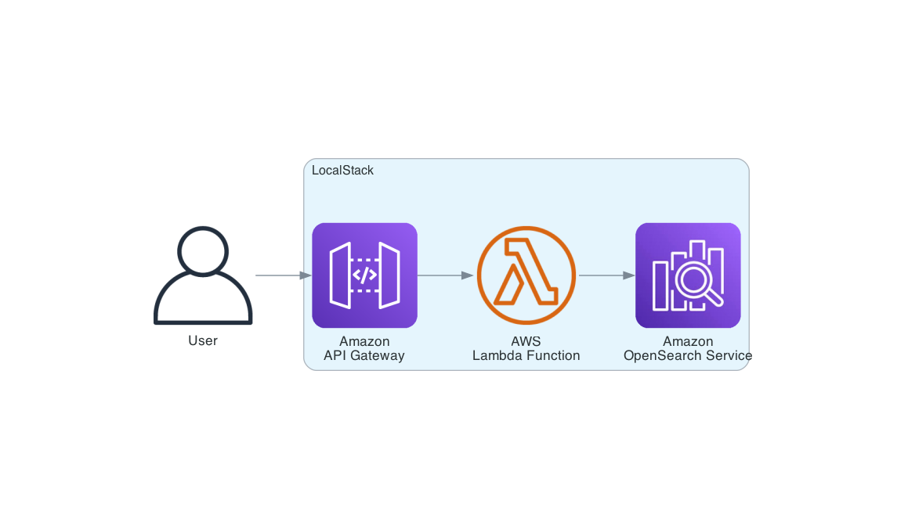
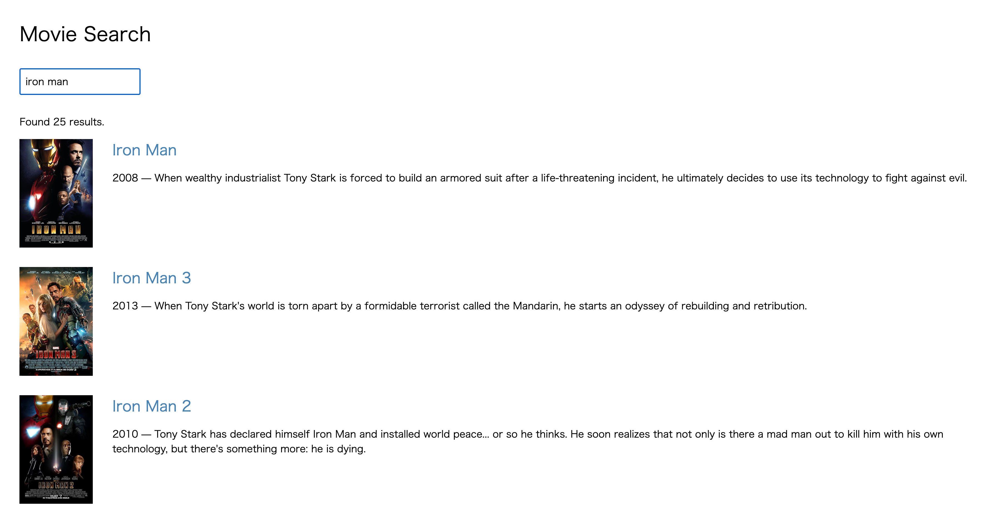

# localstack-opensearch-search-application-tutorial

AWS SAM template for the ["Tutorial: Creating a search application with Amazon OpenSearch Service"](https://docs.aws.amazon.com/opensearch-service/latest/developerguide/search-example.html) using LocalStack.

## Architecture



## Start LocalStack with a Network

```sh
$ localstack start -d
```

## Deploy the AWS SAM Application

```sh
$ samlocal build
$ samlocal deploy
CloudFormation outputs from deployed stack
--------------------------------------------------------------------------------------------------------------------------------------------------------------------------------------------
Outputs
--------------------------------------------------------------------------------------------------------------------------------------------------------------------------------------------
Key                 ApiId
Description         -
Value               xxxxxxxxxx
--------------------------------------------------------------------------------------------------------------------------------------------------------------------------------------------
```

## Load the Dataset

```sh
$ curl -X POST -s -H 'Content-Type: application/json' http://movies.ap-northeast-1.opensearch.localhost.localstack.cloud:4566/_bulk \
    --data-binary @datasets/sample-movies.bulk
```

## Update `search.js`

Replace the placeholder `ApiId` value in `sample-site/scripts/search.js` with the your `ApiId` from the AWS SAM deployment outputs.

```diff
-var apigatewayendpoint = 'http://xxxxxxxxxx.execute-api.localhost.localstack.cloud:4566/Prod/';
+var apigatewayendpoint = 'http://937bzukf8b.execute-api.localhost.localstack.cloud:4566/Prod/';
```

## Search

Open `sample-site/index.html` in your browser and try searching for movies.


